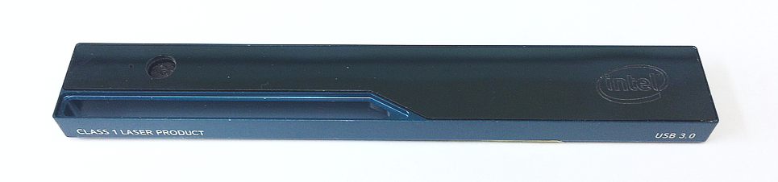
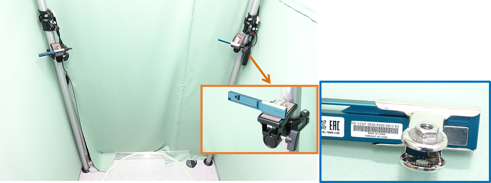

====================
Hardware preparation
====================

Cameras
=======

We suggest using Intel realsense R200 cameras (Fig 1-1) because of their outstanding performance characterized by the lack of interference among cameras when multiple units are simultaneously capturing the same object (see :doc:`09` for details of the camera). A R200 is composed of a color camera and a depth sensor to obtain RGB images and depth images, respectively.

    [Fig 1-1: Intel realsense R200 camera]

# Unfortunately, R200 is now discontinued. However, there are still some stock in the intel store as part of a kit (https://click.intel.com/intelr-realsensetm-robotic-development-kit-2351.html) for robotics. In addition, sometimes it is possible to find them at Mouser Electronics. 
Given that the original USB 3.0 cable of the R200is too short, it is necessary to extend it. We suggest using an "active" repeater cable as found in the link (https://www.amazon.com/dp/B01FQ88CE6)

PC
====
The 3DTracker (except for MATLAB/Python scripts) runs only on Windows 10 (64-bit). The CPU does not need to be very fast. However, the number of cores (number of parallel processers?) in the CPU should be => than the number of cameras used, because the Recorder software processes each camera data in parallel. In addition, a large HDD should be installed in the PC, because of the big size of 3D video. The PC monitor resolution should be more than 1280x1024. We have been recording from four R200 cameras with a HP EliteDesk 800 G2 Core i7-6700 (3.4 GHz), 8GB RAM, 500 GB + 6TB HDD, and a power unit of 400W 80PLUS. 

R200 uses almost the whole transmission bandwidth of an USB 3.0 port. So, more than one R200 cannot be connected to the same USB controller. For this reason, we added three expansion cards (https://www.amazon.co.jp/dp/B00B6ZCNGM) to get in total four USB controllers (including the one embedded in the mother board), thus connecting one R200 per controller. The expansion cards have to be hooked to the PC power supply to feed enough power into the "active" USB extension cable, beside they are inserted in the mother board slots.

.. note::
    We strongly recommend using the same components suggested above to get a high-quality signal. We have tried several different products and those shown above are the best ones based on our experience. 

Camera mounts
=============

    [Fig 1-2]

Example of four depth cameras setup. Each camera was hooked to a post fixed to the floor and the ceiling (insert orange frame), through a custom adaptor made by gluing a 1/4-inch nut to a metal bulldog clip (insert blue frame). The main picture shows two of the four cameras.

.. hint::
    The depth sensor of the camera measures the depth by emitting infrared (IR) light and capturing the IR reflection to objects (see :doc:`09` for the detail of the mechanism of the camera). So, two cameras should not be placed face-to-face, to prevent the infrared sensor from saturating because of directly received infrared light from the other. Similarly, shiny surfaces should not be placed in front of a camera. Thus, we recommend placing the cameras slightly tilted downward from the horizontal plane. The depth sensor of R200 can't detect a depth < 40 cm. The horizontal and vertical field of view of R200 is 59 ± 5 and 46 ± 5 degrees, respectively. These constraints should be considered during camera installation.