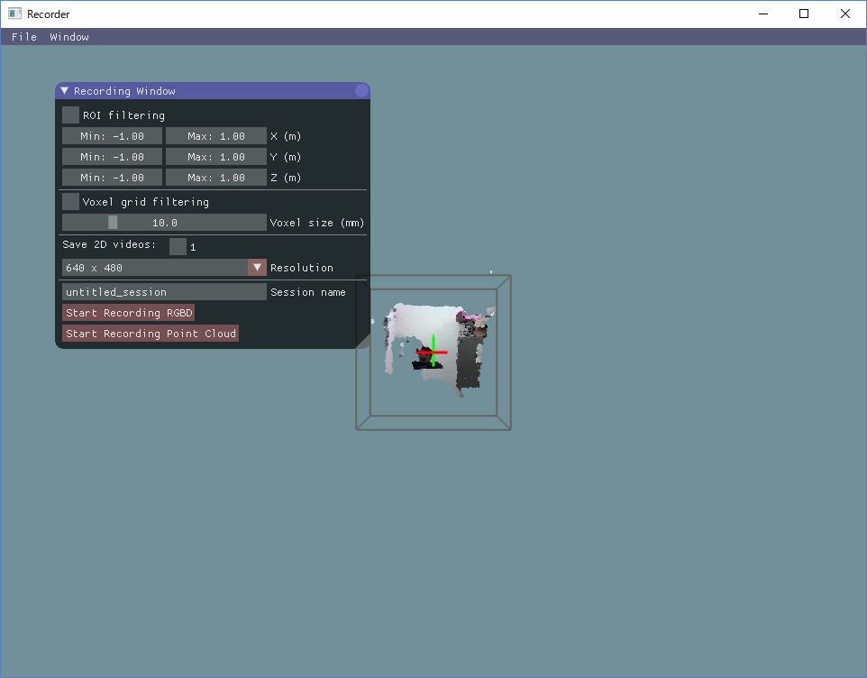
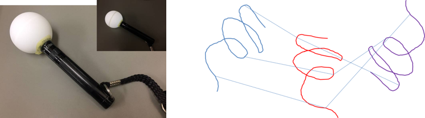
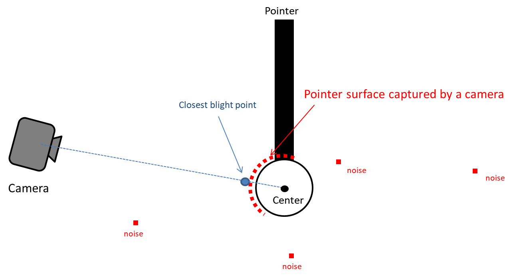

==============
Recorder usage
==============
The Recorder is a module for calibration of the multiple-cameras setup of the 3DTracker system.

Starting the Recorder
=====================
Connect the cameras to the PC and start Recorder.exe. If Recorder.exe doesn’t start, the cameras may have not been recognized (see Chapter 7 for the trouble shooting). Once the Recorder starts correctly, the following screen will appear:

    [Fig 3-1]

You will see a menu-bar, and a 3D view display where camera images are projected as a cloud of points. The 3D view can be controlled with the right button (R) dragging of a mouse, as follows: R + drag -> Rotate the view; R + drag + Ctrl key -> Zoom in and out; R + drag + Shift key -> translate the view. The red, green and blue axes shown in the 3D view represent X, Y, and Z axes, respectively. The remaining tool windows can be displayed from the menu tab > ‘Window’. 

Camera calibration and configuration
====================================
If you look at the point cloud just after starting the Recorder, you will see that the points from different cameras are not correctly aligned. To discriminate clearly between the points from different cameras, you can color the points by enabling "Mark cameras with different colors" in the "Point cloud appearance" window. The misalignment is because of the lack of information about the relative positions of the cameras. The Recorder can estimate the relative positions through a semi-automatic calibration, as follows. During calibration the user scans the recording space with a light pointer, and records the pointer track on the “Calibration window”. Then, the recorder calculates the relative camera positions fitting the observed trajectories recorded from the different cameras during the calibration process. The pointer can be made by epoxying a white ping-pong ball of 40 mm of diameter (Fig 3-2), onto the tip of a white LED flashlight (https://www.amazon.com/dp/B00BIG5JQK/). The ping-pong ball works as a white light diffuser and an IR reflector.

    [Fig 3-2: left, light pointer; right, schematic showing the mechanism. The lines with different colors represent the pointer trajectories observed simultaneously from 3 different cameras in this example.]

The Recorder estimates the center of the pointer based on the closest blight point from a camera and a radius of the ping-pong ball, as shown below.

    [Fig 3-3]

Display the "Calibration window" from the "Window" menu. "Color filtering" setting section is used for detecting bright points that belong to the pointer. Find the best brightness threshold (the value of "Min Brightness" slider) by enabling "Test" check box. 

The "Outlier removal" setting section below the "Color filtering" section is used to remove minor noise referred here as small clusters of blight points because of light reflections, etc. For details about the parameters of the Outlier removal, check here (http://pointclouds.org/documentation/tutorials/statistical_outlier.php). Usually, changing only the "Threshold" parameter is fine. You can also check the effect by enabling the check box "Test".

After adjusting filter settings for the pointer detection, click the "Start pointer tracking" button on the bottom in the "Calibration" window. Then slowly move the pointer in the recording space to draw a trajectory for calibration (a spiral trajectory is recommended). Note that the pointer should be in view of all the cameras. To check the view from each camera, display "Camera Monitor" window.

After drawing the trajectory, click "Stop pointer tracking" button, and filter the trajectories to remove noise in the trajectories in the ‘following window’. Then, click "Use the traces for calibration" to calculate the relative camera positions. If this operation has been successfully done, the point clouds from different cameras should be perfectly aligned. To check the alignment, place some objects in front of the camera and color the points by enabling "Mark cameras with different colors" in the "Point cloud appearance" window. Then, look at the corners and the overall shapes of the objects in the screen. If point clouds with different colors are not well aligned, repeat the operation described above until a good result is achieved. The calibration using the pointer is only for the relative positions among cameras. So, the absolute position of one of the cameras (the reference camera) should be input manually. Move the sliders in the "Reference camera position & pose" section on the top of the "Calibration" window. Set X axis rotation, Y axis rotation, Z axis rotation, and translation. Rotation after translation makes it hard to adjust the position and rotation (see also the video link above). When you set the absolute position, make sure that the Y axis corresponds to the vertical axis, because the Tracker assumes it for fitting purposes. Lastly, set the region of interest (ROI) with the sliders on the top of the "Recording" window. You can also input the value directly by clicking + Ctrl key on slider. The same setting is expected to be useful for the coming recording sessions run with the same setup (unless the camera has been moved). To save and load the setting, use "File menu > save config" and "File menu > load config", respectively. See Chapter 7 for trouble shooting calibration. For more information about calibration see the video at https://youtu.be/04JgLTaYI2c

Recording
=========

To start recording, in the "Recording window", input the data file name in the "session name" text box and click "Start recording RGBD" or "Start Recording Point cloud" button. With "Start recording RGBD", raw data consisting of RGB images and depth (D) images is stored. The size of the raw data is relatively big (around 300 MB/camera/min). With "Start Recording Point cloud", the point cloud data captured from the cameras are stored. Combined with the "ROI filtering" which removes the points outside the ROI, and "Voxel grid filtering" which down samples the points, the size of the point cloud data becomes much smaller than that of the raw RGBD data. Use 5 and 10 mm for the voxel size for the voxel grid filtering for mice and rats, respectively. By enabling the "save 2D videos" check boxes for the cameras, you can also save the 2D RGB video, which is useful for tracking (see Chapter 5), preliminary visual observation of behavior, etc. If you choose recording the raw data (RGBD), you can generate the 2D video offline. So, in this case, it is recommended not to check those boxes to reduce the computational load during recording. 

.. warning::
    if you work with the session name that was used previously, the original data will be overwritten. 

After starting recording, 3D view is disabled and an RGB image is shown instead, reducing the computational load during recording. Click "Stop" button to stop recording. The recorded data is stored in the "data" folder containing the Recorder app ("Recorder.exe") in the folder named as the "session name" that you have input before recording. See Chapter 9 for details about the output files.
