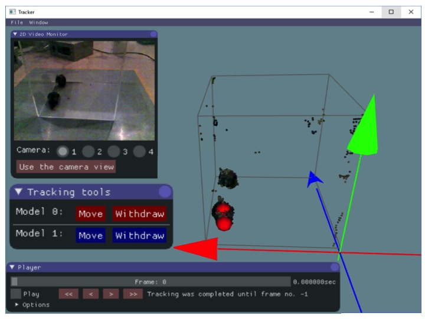
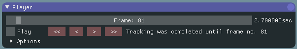
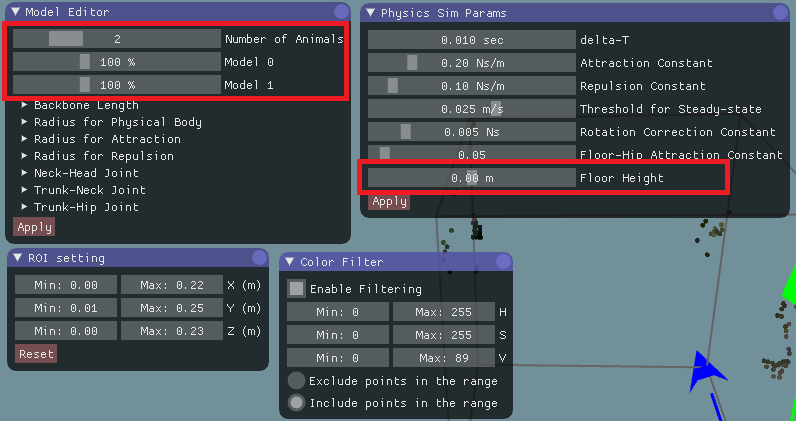
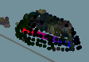
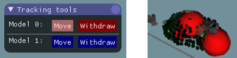
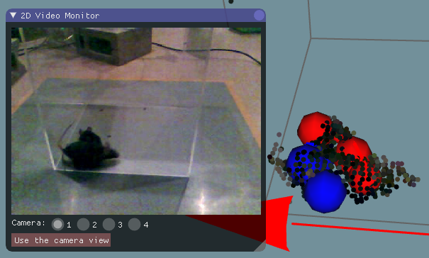
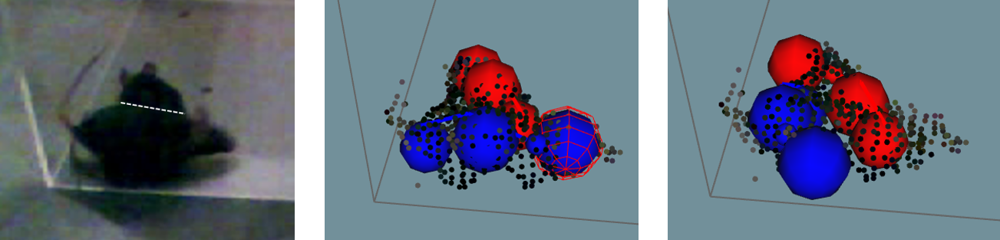
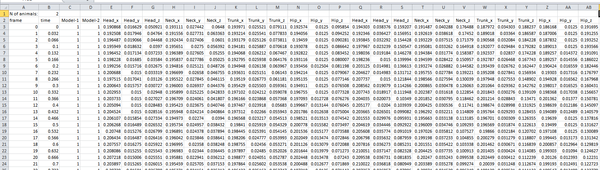

=============
Tracker usage
=============

Starting the Tracker
====================

Start the Tracker and select the xml file in the data folder that you want to analyze. Then, the following screen will appear.  

    [Fig 5-1]

The windows on the screen are those you can launch by clicking the tabs in the menu Window. In addition, the skeletal models represented by connected spheres are shown in the Tracker screen. The 3D view can be controlled with the right button (R) by dragging the mouse as follows: R drag -> Rotate the view; R drag + Ctrl key -> Zoom in and out; R drag + Shift key -> translate the view. 

The following "Player window" is used for searching a video frame and fitting execution.

    [Fig 5-2]

The numbers inside, and at the right side of the top slide bar, indicate the current # of the video frame and time, respectively. You can move the slide bar to search a specific video frame. By checking the box "Play" you can start the playback. The fitting of the skeleton models for pose estimation during playback is for the frames where it was not estimated. For the frames where it has already been estimated, the result of fitting is shown. The progress during the fitting process is displayed as "Tracking that has been completed...". When starting the fitting process, you have to do it from the first frame and then continue with the next one. **DO NOT skip frames** during the fitting since it can result in an irreversible corrupted physic simulation.

Importing and setting parameters
================================
Before starting the fitting, you need to set some parameters for the process. The default parameters (e.g., dimensions of a skeletal model) are optimized for rats. So, to analyze mice, import predefined parameters for mice (e.g., Track_params_mouse_v20171104.xml) from "File Menu > Import params". The parameters can be displayed and modified with the "Model Editor window", "Physics sim params window", "ROI setting window", and "Color filter window". 

    [Fig 5-3]

The "Model Editor window" is for the skeletal models. The slider on the top defines the number of animals (skeletal models). The scale of an animal can change depending on its age, sex, etc. So, you may need to change the scales using the other sliders in the red rectangle as shown in Fig 5-3. Detailed parameters outside the red rectangle (e.g., "Backbone Length", "Radius for Physical Body", etc.) don’t need to be changed frequently. After changing the parameters in the "Model Editor window", click "Apply" button on the bottom, to apply the change. 

The "Physics sim params window" is to parametrize the fitting algorithms, and usually it is necessary to change just some of them. The value of the "floor height" should be set to the height of the floor where the animal is standing in the global coordinate system. This parameter is important to constrain the movement of the model. The details of the parameters mentioned above are described in Chapter 9.  

"ROI setting window" and "Color filter window" can be used to remove the points of non-animal objects. Removing such points will help fitting the skeleton models to the points cloud. In the color filtering, set the range of colors to include/exclude in the HSV color space (https://en.wikipedia.org/wiki/HSL_and_HSV). These parameters could be repeatedly used for the same experimental setup regarding rodent strain, age, apparatus, etc. You can re-use the parameters by exporting and then importing them from the "File menu > Export params" and "File menu > import params", respectively. 

Fitting
=======

After the parameters have been set, start the fitting. Note that you cannot change the parameters during the fitting, otherwise the fitting will be re-initialized. In the first frame, manually set the initial position of the skeletal models. With shift key pressed, click two points from hip to head. You will see a line like the one in the figure below.

    [Fig 5-4]

If it is hard to know the direction of the subject in a 3D view, try using "2D video monitor window" as shown in Fig 5-1. Then, click the "Move" button in "Tracking tools window" to change the skeleton model to the correct place (Fig 5-5).

    [Fig 5-5]

The model is automatically fit from the initial position. If you find that the model was not fitted properly, manually adjust it by dragging body parts (sphere) of the model with the left mouse button. After placing the skeleton models, start the fitting process by enabling the "Play" check box in the "Player window". The positions shown during the play are the result of the fitting process. As the fitting progresses, when you find an error in fitting, such as when a big part of a model is outside the 3D image, reversed direction, or swapping between animals (Fig 5-6), pause the fitting by disabling the "Play" check box. 

    [Fig 5-6: an example of swapping error]

Then, by clicking "<<", "<", ">", and ">>" buttons in the "Player window", go back to the frame when the models start to get the error (Fig 5-7, middle). Then, manually adjust the models by dragging body parts (Fig 5-7, right) and re-start fitting from that frame by enabling "Play" check box. 

    [Fig 5-7: correction of the swapping error shown in Fig. 5-6. Left: Actual mice positions, middle: before correction, right: after correction.]

If you find an error again, pause and fix it following the instructions described above. Repeat it and then progress with the fitting up to the last frames. 

.. hint::
    The Tracker has many functions to support this semi-automatic fitting process:

    + The speed of playback can be changed in "Option" in the "Player window". 
    + "Play" check box can be switched by pressing the space key.  
    + By rotating the mouse wheel during the video pausing you can change the video frame. 
    + By rotating the mouse wheel during playback it changes the playback speed. 

.. note::
    The fitting process must be done without skipping frames to get a successful result. Even if you don't have an animal in the first frame, start from the first frame and not from the frame when the animal appears. For the fitting during the absence of animals, you can withdraw the model with "Withdraw" button in "Tracking tools window". Note that the fitting process will be skipped if you move the frame using the slider on the top of the "Player window" or "<<", "<", ">", or ">>" button below. When you restart the fitting after the manual correction, make sure that it restarts from the frame that you have corrected (check the progress of fitting in "Tracking has been completed..." display). 

Saving and Exporting the fitting result
=======================================
Once you have finished the fitting, you can re-check the result by playback or moving the slider in the "Player window". The fitting result won't be changed just by replaying the frames. 
You can save the fitting result from "File menu > Save result". The result will be automatically loaded the next time you open the data. You can also reset the results to the one saved last time from "File menu > Load result". This save/load function is also useful to interrupt the work.
For the data analysis on the trajectories of body parts, you can export the csv format file (Fig 5-8) from "File menu > Export result".

    [Fig 5-8]
