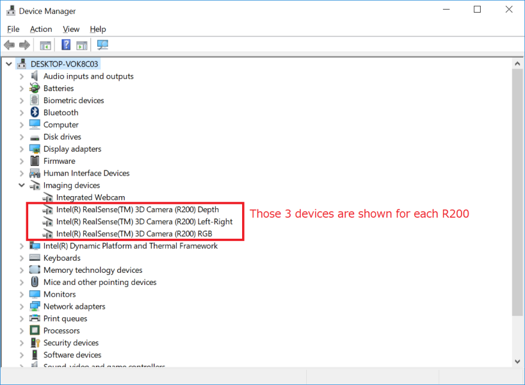
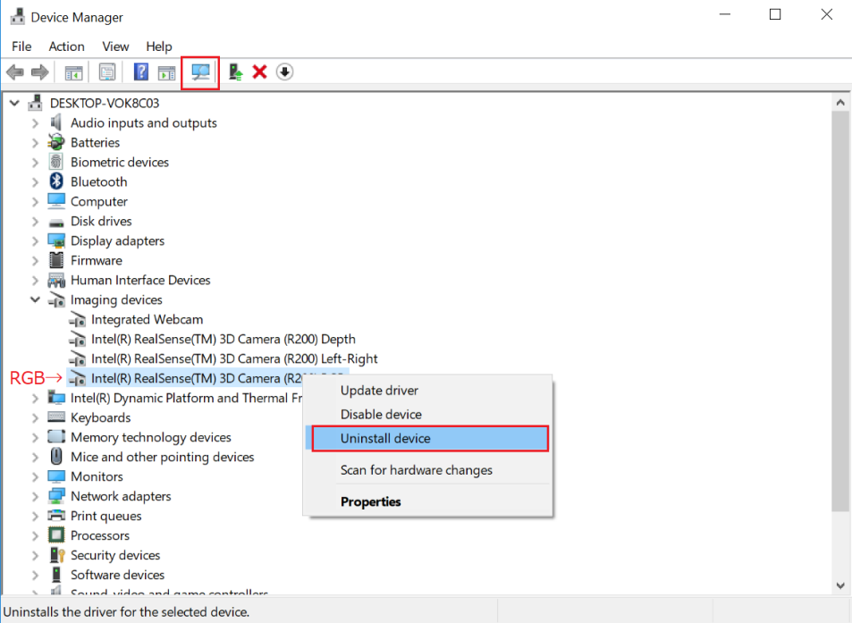
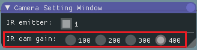

================
Trouble shooting
================

If you cannot find a specific topic associated to the 3DTracker or the solution for related some issue, ask your question in our forum (https://groups.google.com/forum/#!forum/3dtracker). 

Recorder does not start (with R200 cameras)
===========================================
The camera may not be recognized by the PC. Re-check the connection of the camera according to Chapter 2. If the problem persists, check whether the camera is listed in the "Device manager" (Fig 7-1).

    [Fig 7-1]

If the camera is not listed, make sure that "USB selective suspend" is disabled (https://www.techsupportalert.com/content/how-fix-annoying-windows-usb-problem.htm). 
If the camera is listed but the problem persists, uninstall the device of RGB camera and re-install it by clicking "scan for hardware changes" icon (Fig 7-2). It has been reported that a RGB camera driver error happens after "Windows 10 Creators Update", and the steps above fix the problem. 
(https://github.com/IntelRealSense/librealsense/issues/481). 

    [Fig 7-2]

Calibration does not work well
==============================

We suggest trying the following:

+ Change the infrared (IR) gain of the R200. If the camera is too close to the surface recorded or number of cameras is big, the IR reflection become too strong saturating the IR sensor. The data in the saturated part will be lost, interfering the pointer tracking during the calibration. Reduce "IR camera gain" in "Camera setting window" to avoid the saturation (Fig 7-3; see also :doc:`09` for the camera mechanism). 

    [Fig 7-3]

+ Check the area to scan with the pointer. Show "Camera monitor window" and make sure the pointer is always inside the view of all the cameras, and the distance between pointer and cameras is always more than 40 cm (R200 sensor can't detect a depth < 40 cm). Also make sure the pointer light is not strongly reflected by the floor or other objects. 
+ Change the room illumination and filters for the pointer detection. Adjusting the "Color filter", "Outlier removal", and room illumination will improve the quality of the pointer tracking.

Object or animals are not captured
==================================

+ Change the infrared (IR) gain of the R200 as it is described above.
+ Check for objects in front of the camera (R200). The RGB camera in the R200 can be seen from outside. However, the other two IR sensors and the IR emitter are behind the blue case. For information about the R200 structure see the link:  https://www.intel.com/content/dam/support/us/en/documents/emerging-technologies/intel-realsense-technology/realsense-camera-r200-datasheet.pdf).  
+ Check the color of the object. Surfaces without IR reflection cannot be captured (e.g., deep black colored plastic). In the case you need to consider changing the color of the object. Mice with black coats (e.g., C57BL/6) can be captured without any problem.

Dropping frames during recording
================================

Before you buy a faster PC, try the following:

+ Wait long enough after the PC boots (PC is often slow just after boot).
+ Change Windows setting to reduce the computational load for the other processes running in parallel (e.g., https://www.cnet.com/how-to/easy-ways-to-speed-up-windows-10/).  

Menu bar invisible / mouse offset from view
===========================================

The problem can happen with an old driver of Intel HD Graphics video card (https://developer.blender.org/T51521). Update the driver.
