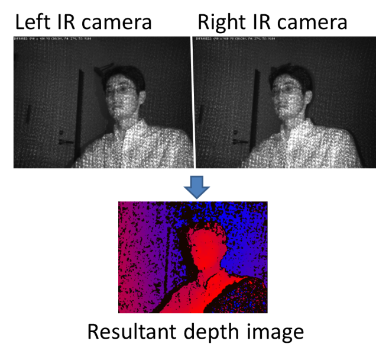
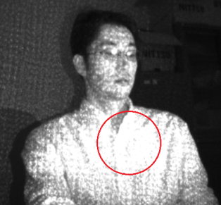

========
Appendix
========

R200 camera mechanism
=====================

ntel realsense R200 contains one RGB camera, two IR cameras, and one IR emitter. The IR emitter projects a random IR pattern to the objects (Fig 9-1, upper pictures). Distances from the camera to the objects' surface are calculated using two IR camera images based on binocular disparity. As a result, a depth image (Fig 9-1, bottom picture), where each pixel in the image represents distance from the camera to the object surface, is generated. 

    [Fig 9-1]

In 3DTracker software, a colored 3D point cloud is generated from the depth image and the RGB image captured by R200. Because R200 uses binocular disparity, the R200 cameras do not interfere each other. This is an excellent feature of R200 compared to the other 3D cameras (for example, ToF cameras, like Kinect v2) that severely interfere with each other. Although the R200 can work well in a multi-camera setup, if many of them are recording an object closely, the R200 would receive too much IR light causing some saturation (red circle in Fig 9-2).

    [Fig 9-2]

There is no binocular disparity in the saturated area, so the depth of the area cannot be calculated. By reducing the IR camera gain (in "Camera setting window" of the Recorder app), the saturation can be avoided. For the details of R200, see the Intel datasheet:
https://www.intel.com/content/dam/support/us/en/documents/emerging-technologies/intel-realsense-technology/realsense-camera-r200-datasheet.pdf 

Details of the parameters in the Tracker
========================================

*Coming soon*.

For reference see Matsumoto et al., 2013:
http://journals.plos.org/plosone/article?id=10.1371/journal.pone.0078460

Output files
============

The data of a recording session is saved as multiple files in the same folder. Each of the files contains data of different type and/or camera, as follows: 

+ [Session_name].metadata.xml: metadata file, which stores recording configurations.
+ [Session_name].2dvideo.[N].avi: 2D RGB video of camera no. N.
+ [Session_name].camintrin.[N].bin: internal parameter of camera no. N.
+ [Session_name].rgbd.frame.[N].bin: RGBD data of camera no. N.
+ [Session_name].rgbd.ts.[N].txt: the timestamp of the RGBD data
+ [Session_name].pc.frame.[N].bin: Point cloud data of camera no. N.
+ [Session_name].pc.ts.[N].txt: the timestamp of the point cloud data
+ [Session_name].mrgpc.frame.bin: Merged point cloud data generated by Preprocessor
+ [Session_name].mrgpc.ts.txt: the timestamp of the merged point cloud data
+ [Session_name].trackparam.txt: Tracker parameters
+ [Session_name].trackresult.bin: Tracker result

