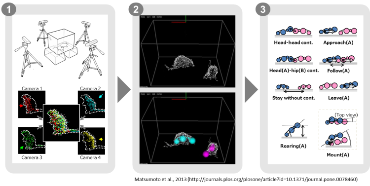

.. 3DTrackerFAB-doc documentation master file, created by
   sphinx-quickstart on Thu Nov 16 00:49:26 2017.
   You can adapt this file completely to your liking, but it should at least
   contain the root `toctree` directive.

===========================
3DTracker-FAB documentation
===========================

The document was written by Dr. Jumpei Matsumoto and Dr. Marcelo Aguilar-Rivera.
We thank Dr. Laleh Quinn for her proof reading.

Introduction
============

The 3DTracker-FAB (for animal behavior) is an open source software for 3D-video based computerized behavioral analysis. The 3DTracker-FAB will help users acquire and analyze 3D trajectories of animal body parts, as shown below.

    [Fig 0-1]

First, animals 3D imagines are reconstructed from depth cameras (~4) images (Fig 0, left). Second, body positions are estimated by fitting skeletal models to the 3D image (Fig 0, middle). Third, several behavioral parameters are calculated based on body part trajectories (Fig 0, right).

In the current workflow, a set of software modules are used. The images from multiple cameras are calibrated and recorded, with the "Recorder" module (Chapter 3). Then, the recorded images from different cameras are processed off-line for their integration into a full 3d image, down sampling, etc., with the "Preprocessor" module (Chapter 4). Then, the skeletal models are fitted to the 3D image, with the "Tracker" module (Chapter 5). Finally, the resultant 3D trajectories (csv file format) is analyzed with Python/MATLAB scripts (Chapter 6).
The present version of the 3DTracker-FAB only supports the analysis of rats and mice. The scripts for post-processing of the trajectories are in preparation. Other species could be supported in the future.

The 3DTracker-FAB is basically licensed under an MIT license. So, note that the software is provided "as is", without warranty of any kind, express or implied.

Index
=====

.. toctree::
   :maxdepth: 2
   :numbered:
   
   01
   02
   03
   04
   05
   06
   07
   08
   09

**Date last modified: 2018.01.22**
